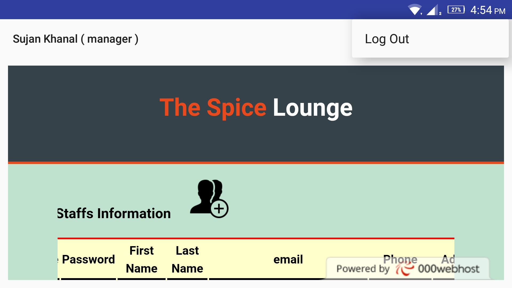

###########
Screenshots
###########

1. Manager
==========

   Admin panel

2. Cashier
==========

.. figure:: images/cashier.jpeg
   :alt: Cashier panel  

   Cashier panel

.. figure:: images/cashierStatus.jpeg
    :alt: Cashier panel  

    Cashier can checkout table with all served food status.

|
|

3. Chef
=======

.. image :: images/chef.jpeg
    :scale: 25%
    :align: left

.. image :: images/chefMenu.jpeg
    :scale: 25%
    :align: right

.. image :: images/chefAddFoodItem.jpeg
    :scale: 25%
    :align: left

|
|

4. Waiter
=========

.. image :: images/foodmenu.jpeg
    :scale: 25%
    :align: left

.. image :: images/waiter.jpeg
    :scale: 25%
    :align: right

|
|
|

.. image :: images/waiterStatusView.jpeg
    :scale: 25%
    :align: left

|
|

5. Customer
===========

.. image :: images/foodmenu.jpeg
    :scale: 25%
    :align: left

.. image :: images/custSelectingTable.jpeg
    :scale: 25%
    :align: right

|
|

.. image :: images/custTableSelected.jpeg
    :scale: 25%
    :align: left

.. image :: images/custGivingFeedback.jpeg
    :scale: 25%
    :align: right
